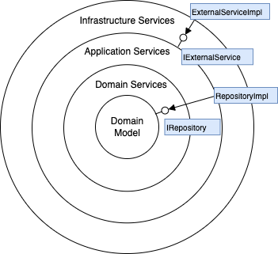

# 洋葱圈架构：Unity 开发者的通俗指南

## 引言

在软件开发中，架构设计就像盖房子的蓝图，直接决定了代码的质量和未来维护的难易度。[洋葱圈架构（Onion Architecture）](https://jeffreypalermo.com/2008/07/the-onion-architecture-part-1/)，也叫干净架构（Clean Architecture），是一种简单却强大的设计模式，它由 Jeffrey Palermo 在 2008 年提出，旨在解决传统分层架构中的一些问题，特别是关注点分离和依赖方向的控制。它把应用程序分成几个同心圆层，每一层有自己的职责，而且层与层之间的依赖关系非常明确——内层不知道外层的存在，外层却可以依赖内层。这种方式能让你的代码更易维护、更易测试、更易扩展。

## 什么是洋葱圈架构？

想象一个洋葱，剥开一层又一层，每一层都包裹着更核心的东西。洋葱圈架构就是这样一种设计模式，把应用程序分成几个同心圆层：

- **最内层**：核心业务逻辑，比如游戏规则、角色属性这些"灵魂"部分。
- **中间层**：应用程序的服务和逻辑，负责协调核心层干活。
- **最外层**：用户界面和外部系统，比如 UI 按钮、Unity 引擎的输入输出。

### 核心思想

- **内层不依赖外层**：核心业务逻辑不关心外面的世界，比如它不认识 Unity 的 API。
- **外层依赖内层**：外层通过接口调用内层，保持灵活性。

### 为什么在 Unity 中特别实用？

洋葱圈架构在 Unity 中特别实用，原因是 Unity 开发中往往同时存在纯 C# 代码和 Mono 代码。例如：

- 游戏中的战斗系统，考虑到性能、多引擎支持、局外测试以及后期可能将战斗逻辑抽离到服务端，往往会选择纯 C# 开发
- 但游戏表现层肯定需要调用 Unity 接口
- 洋葱圈架构很好地解决了 Mono 和纯 C# 代码共存的问题

## 在 Unity 中应用洋葱圈架构的三层结构

### Assembly Definition 配置

为了在 Unity 中实现洋葱圈架构的依赖管理，可以使用 Assembly Definition 文件（.asmdef）来配置各层的依赖关系：

| 层           | asmdef 依赖              | 说明                                                                                                                                  |
| ------------ | ------------------------ | ------------------------------------------------------------------------------------------------------------------------------------- |
| Core         | 仅 mscorlib              | 纯 C# 领域层：实体、值对象、用例、接口（如 IAudioService、ISaveService）。无 UnityEngine 引用，可在服务器或编辑器测试运行。           |
| Infra        | Core, UnityEngine        | 基础设施适配层：用 MonoBehaviour/ScriptableObject 实现核心层接口（如 UnityAudioService、JsonSaveService）。只做"桥接"，不含业务逻辑。 |
| Presentation | Infra, UnityEngine.UI 等 | UI、场景脚本、特效等纯表现代码；只依赖接口，不直接操作领域对象。                                                                      |

这种"洋葱式"依赖方向确保最核心的代码始终独立、可测试。外层（Presentation）依赖基础设施层（Infra），基础设施层依赖核心层（Core），而核心层不依赖任何外部层。

### 1. 核心层（Core Layer）

#### 职责

- 定义应用程序的核心业务逻辑、实体和接口

#### Unity 中的作用

- 负责游戏的核心数据模型和业务规则
- 例如玩家的属性（如生命值、攻击力）或物品数据

#### 特点

- 使用纯 C# 实现，不依赖 UnityEngine 或任何外部 API
- 可在服务器、编辑器或其他非 Unity 环境中运行和测试

#### 举例

- `ILogService` 接口：定义日志功能
- `ISaveService` 接口：定义存档功能

### 2. 基础设施层（Infra Layer）

#### 职责

- 实现核心层定义的接口
- 与外部系统（如 Unity 引擎）交互

#### Unity 中的作用

- 负责与 Unity 引擎对接的代码
- 例如输入处理、日志输出或存档实现

#### 特点

- 依赖核心层
- 使用 MonoBehaviour 或 Unity API（如 PlayerPrefs）桥接引擎功能
- 不包含业务逻辑

#### 举例

- `UnityLogger`：实现 ILogService，调用 Debug.Log 输出日志
- `UnitySaveService`：实现 ISaveService，使用 PlayerPrefs 保存和加载数据

### 3. 用户界面层（Presentation Layer）

#### 职责

- 处理用户交互和界面展示

#### Unity 中的作用

- 负责 Unity 的 UI 系统（如 Canvas、Button）或场景控制逻辑

#### 特点

- 依赖基础设施层
- 通过调用服务获取数据或触发操作

#### 举例

- `SaveLoadUI`：一个 MonoBehaviour 脚本，显示存档/加载按钮，并调用存档或日志服务

### 其他

之前写的[服务定位器](../../GameProgrammingPatterns/16.ServiceLocator/README.md)是纯 C#的，当游戏中同时存在 Mono 的服务的时候，就不是很优雅了。比如说 AudioManager 要调用 UnityEngine 的代码，它就不合适被注册到 C#的服务定位器中。要想解决这个问题

~~1. 定义两个服务定位器~~ 2. 配合使用洋葱圈架构，服务定位器在 Core 层，Infra 层作为桥定义接口，View 层面向服务的接口进行开发。

## 我见

洋葱圈架构通过分层设计，让内层专注于业务逻辑，外层处理交互和展示，实现了代码的高内聚低耦合。对于 Unity 开发者来说，是一种很好的分层 C#核心层和 Mono 层的架构。
